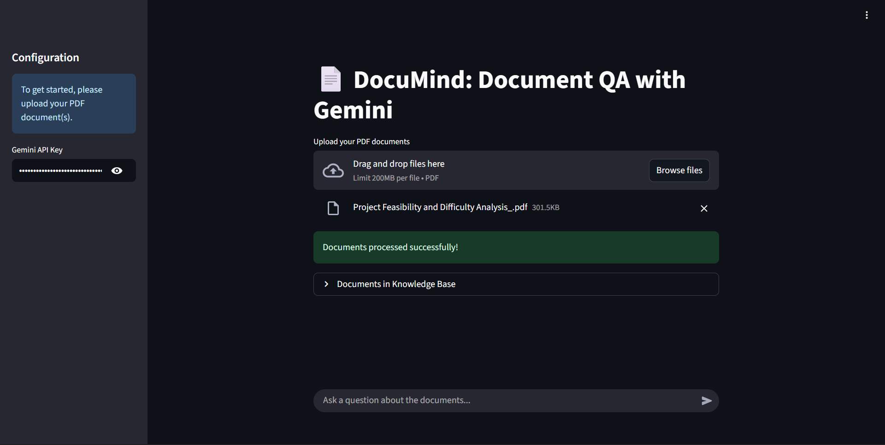
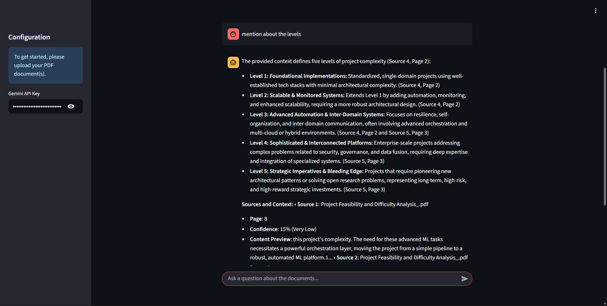

# 🚀 DocuMind — when your documents finally speak for themselves


> **Narrative Hook:** *Your documents finally learn to speak for themselves.*
> **Real-World Challenge:** 51% of workers say GenAI often lacks useful, grounded information.
> **Mission:** Turn static PDFs into a trusted, conversational knowledge system with citations, confidence… and speed.


---


<p align="center">

&nbsp;&nbsp;

</p>


<p align="center">
<a href="https://opensource.org/licenses/MIT"></a>


</p>


---


## 🧠 What is DocuMind?


DocuMind is a **RAG (Retrieval-Augmented Generation)** assistant for PDFs and company docs.
It ingests documents, chunks them intelligently, indexes embeddings in a vector DB, and answers questions with **source-grounded** responses and **confidence scores**. Built for **speed, transparency, and trust**.


---
## Features
- Intelligent PDF ingestion and chunking
- Semantic search with Google Generative AI embeddings
- AI-powered question answering (Gemini 2.0)
- Source attribution: page numbers, file names, content previews
- Confidence scoring system (Very High to Very Low)
- Modern, responsive Streamlit web interface
- Dockerized for easy deployment (Hugging Face Spaces supported)

---
## 🧪 Trust by Design


**Citations**
- Every answer lists **file names + page numbers** and **200-char snippet previews**.
- Clicking a citation focuses the exact passage (UI highlight).


---


**Anti-Hallucination Controls**
- Retrieval-strict prompts (“cite before claim”)
- Empty-answer allowed (better honest than wrong)
- Optional answer-length limiter + grounding checker


---


## 🖥️ Using DocuMind


1. **Upload PDFs** (one or many).
2. DocuMind **parses → chunks → embeds → indexes**.
3. Ask a question in plain English.
4. Get an answer with **citations + confidence**.
5. Expand a citation for **inline preview** and jump to context.


---

## Installation Guide

### 1. Clone the Repository
```bash
git clone https://huggingface.co/spaces/KingArthur111/DocuMind.git
cd DocuMind
```

### 2. Set Up Python Environment
```bash
python -m venv .venv
source .venv/bin/activate  # On Windows: .venv\Scripts\activate
pip install --upgrade pip
pip install -r requirements.txt
```

### 3. Run Locally
```bash
streamlit run src/streamlit_app.py
```

### 4. Docker Deployment
Build and run the app in Docker:
```bash
docker build -t documind .
docker run -p 8501:8501 documind
```

### 5. Hugging Face Spaces
Just push to your Hugging Face Space and it will auto-build using the provided Dockerfile.

## Usage
1. Upload one or more PDF documents.
2. Ask questions in natural language.
3. View answers with source citations, page numbers, and confidence scores.
4. Explore document context and preview relevant content.

## Screenshots
Add screenshots here to showcase:
- The document upload and QA interface
- Example answer with source attribution and confidence scores

```


```

## Future Upgrades
- <Real-World Challenge: RAG systems struggle with context windows and multi-step reasoning>
- Narrative Hook: " An AI that remembers conversations and connects the dots "
- Build an advanced RAG system that maintains conversation memory, handles multi-turn queries, and retrieves from multiple data sources (documents, databases, APIs).
- Include advanced chunking, re-ranking, and query expansion techniques.
- Tech Stack: LangChain/LlamaIndex, vector databases, Redis, FastAPI, advanced embedding models
- Success Metrics: Handle 10+ turn conversations, improve accuracy to 90%


---
Built with ❤️ using Streamlit, Gemini AI, and ChromaDB
